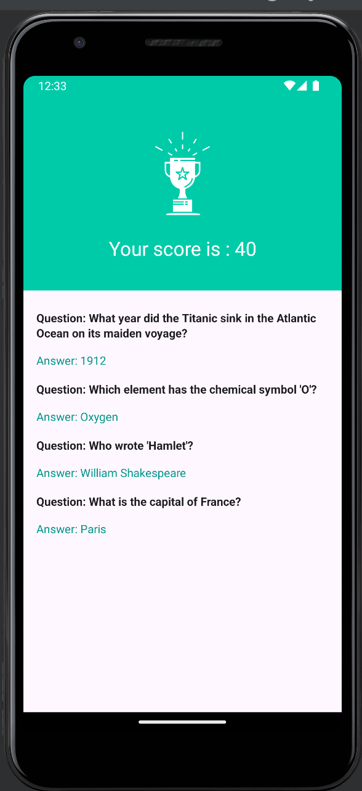

# QuizCraze App

## Introduction
QuizCraze is an exciting quiz application designed to challenge users' knowledge on a variety of subjects. This app incorporates Firebase Authentication to provide a secure login system for users, ensuring their data privacy and enabling personalized experiences. With Firebase integration, QuizCraze also keeps track of users' login status, allowing seamless access to quizzes without repeated authentication.

# Features
- **Secure Authentication:** Users can securely sign in to QuizCraze using Firebase Authentication.
- **Persistent Login:** QuizCraze remembers users' login status, providing uninterrupted access to quizzes.
- **Quiz Taking:** Explore a wide range of quizzes and test your knowledge on diverse topics.

## Screenshots

  
 
  


## Getting Started
### Prerequisites
- Android Studio 2020.3.1 (Arctic Fox) or later.
- Kotlin plugin installed.
- Min Android SDK version 21.

## Installation
**Clone this repository:**
```
git clone https://github.com/your_username/quizcraze.git
```
**Open the project in Android Studio.**

**Sync Gradle and build the project.**

## Using the App
Start by logging in to QuizCraze using your Firebase credentials. Once logged in, explore the available quizzes and select one to take. Answer the quiz questions and submit your responses to see your score. QuizCraze ensures a seamless experience by remembering your login status for future sessions.

## Sample App
Explore the provided sample app to experience QuizCraze's functionality firsthand. Dive into the quizzes, test your knowledge, and enjoy the engaging quiz-taking experience.

## Running the Sample App
Open the project in Android Studio.
Select a device or emulator.
Run the application.

# Support
If you encounter any issues or have questions, please contact sidmundece17@gmail.com.

# Contributing
Contributions are welcome! Please refer to our Contributing Guide for instructions on making pull requests and contributing to QuizCraze's development.

# License
This project is licensed under the MIT License - see the LICENSE file for details.
